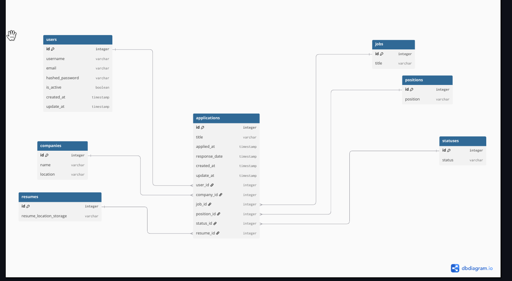

# Job Tracker API

A backend REST API for managing job applications and organizing the job-search process.

This project was built as a portfolio project to demonstrate the ability to design and implement a reliable backend application using FastAPI, PostgreSQL, SQLAlchemy, authentication, database migrations, Docker, and automated testing.

## Features

- User registration and authentication
- JWT-based authentication
- Get the currently authenticated user
- Update and delete user information
- Create, update, delete, and retrieve job applications
- Users can access only their own job applications
- Add companies
- List available jobs, statuses, and positions
- Automatic database initialization on application startup
- Initial metadata seeding for jobs, statuses, and positions
- Database migrations with Alembic
- Unit, integration, and system tests

## Tech Stack

- Python 3.12+
- FastAPI
- SQLAlchemy 2
- Pydantic 2
- PostgreSQL
- SQLite
- Alembic
- Docker
- Docker Compose
- Pytest

## Architecture

The application follows a layered backend architecture with separate API routers, services, repositories, schemas, and database models.

The main request flow is organized around:

```text
Client
  ↓
FastAPI Routers
  ↓
Services
  ↓
Repositories
  ↓
SQLAlchemy / Database
```

### Database / ER Diagram

The database contains users and job applications as the main domain entities, with supporting entities such as companies, jobs, positions, statuses, and resumes.

>  the database / ER diagram.





## Project Structure

```text
job-tracker-api/
├── app/
│   ├── api/
│   │   └── v1/
│   │       ├── auth.py
│   │       ├── application.py
│   │       └── metadata.py
│   ├── core/
│   ├── db/
│   │   ├── database.py
│   │   └── seeder.py
│   ├── models/
│   ├── repositories/
│   ├── schemas/
│   ├── services/
│   └── main.py
├── tests/
├── alembic/
├── Dockerfile
├── docker-compose.yml
├── requirements.txt
└── .env.example
```

## Getting Started

### Prerequisites

To run the project locally, you need:

- Python 3.12+
- PostgreSQL

For the recommended Docker-based setup:

- Docker
- Docker Compose

### Installation

Clone the repository:

```bash
git clone git@github.com:aliadde/job-tracker-api.git
cd job-tracker-api
```

Create and activate a virtual environment:

```bash
python -m venv venv
source venv/bin/activate
```

Install the dependencies:

```bash
pip install -r requirements.txt
```

Create the environment file:

```bash
cp .env.example .env
```

Then configure the required environment variables in `.env`.

### Environment Variables

The project uses environment variables for application and database configuration.

The `.env.example` file contains the required variables:

```env
APP_NAME=
DEBUG=
API_V1_STR=
SECRET_KEY=
ACCESS_TOKEN_EXPIRE_MINUTES=

POSTGRES_USER=
POSTGRES_PASSWORD=
POSTGRES_DB=

DATABASE_URL=
DATABASE_URL_ALEMBIC=
```

Do not commit your actual `.env` file or real secrets to the repository.

## Running with Docker

Docker Compose is the recommended way to run the complete application with PostgreSQL.

Start the services with:

```bash
docker compose up -d
```

After the containers are running, the API is available at:

```text
http://localhost:8000
```

The interactive API documentation is available at:

```text
http://localhost:8000/docs
```

To stop the services:

```bash
docker compose down
```

## Database

PostgreSQL is used as the primary database for the application and production-oriented system testing.

SQLite can be used for unit and integration tests. System tests are preferably executed against PostgreSQL so that the application is tested against the same database technology used in the production-oriented environment.

### Database Initialization

When the application starts, it checks and creates the required database tables if they do not already exist.

The application also runs the database seeder during startup. The seeder initializes required metadata such as jobs, statuses, and positions. Existing data is not recreated unnecessarily.

### Migrations

Alembic is used for database schema migrations.

When the database schema changes, create and apply an appropriate migration before running the updated application.

Typical Alembic commands are:

```bash
alembic revision --autogenerate -m "describe change"
alembic upgrade head
```

## API Documentation

The API provides interactive OpenAPI documentation through FastAPI.

After starting the application, open:

```text
http://localhost:8000/docs
```

The API is organized into the following main areas:

```text
/auth
/app
/metadata
```

Authentication endpoints include:

```text
POST /auth/register
POST /auth/login
GET  /auth/current_user
```

Application endpoints provide authenticated users with operations for managing their own job applications.

Metadata endpoints provide access to available jobs, statuses, positions, and company-related operations.

For the complete list of endpoints, request schemas, response schemas, and authentication requirements, use the generated Swagger documentation at `/docs`.

## Testing

The project contains three levels of automated tests:

- Unit tests
- Integration tests
- System tests

There are currently **87 tests** covering the application.

Run the test suite with:

```bash
pytest
```

### Unit Tests

Unit tests verify individual components and pieces of application logic in isolation.

### Integration Tests

Integration tests verify the interaction between application components and the database.

SQLite with `aiosqlite` is preferred for these tests, although the test setup can support the database configurations provided by the project.

### System Tests

System tests send real HTTP requests to the running application and verify complete application scenarios.

These tests are preferably executed against PostgreSQL to test the application in a production-oriented database environment.

## License

This project is licensed under the MIT License.

See the `LICENSE` file for details.
